# سجلّ الهويات

> مالكه القاعدة `10.5` في `docs/قواعد-الويب.md`، ويطلبه البند `6.2.15` من بوابة التسليم. والقيم السيادية — التوقيع والعلم والعقاب — تبقى لـ`~/khaldoun/identity/values.md` ولا تدخل هذا الجدول.
>
> **تسجيلٌ بلا عتبة.** لا قاعدة هنا تقول «لا تكرّر» — القاعدة **«اذكر لماذا اخترت»** (`10.6`). والتكرار المختار ليس عطباً؛ العطب هو التكرار غير المختار.
>
> **وأيّ عتبة رقمية تُشرَّع من هذا الجدول لا قبله.** فُكِّر في فرضِ فارقٍ مقيس (٣٠° في دائرة اللون) ورُفض عمداً: لا سند لرقمٍ كهذا، ودقّةٌ زائفة أسوأ من غيابها. بعد عشرة مشاريع يقول الجدول أين التكرار، فتُبنى العتبة على بيانات.

## خطّ الأساس المقيس — 2026-09-06

جُرِد **٤٦ مشروعاً** في `~/Movies` قبل تحرير القواعد من القيم المسمّاة:

| القياس | النتيجة |
|---|---|
| خلفية سوداء مطلقة | **٣٤ من ٤٦** |
| `#FFFFFF` · `#000000` | 29 · 27 مشروعاً |
| الذهبي — **أربع درجات متنافسة** | `#C8960C` (17) · `#CFA858` (10) · `#C9A557` (6) · `#C9A84C` (5) |

**والعطب كان مزدوجاً:** تكرارٌ عبر المشاريع، وانفلاتٌ داخلها. فما كان هويةً موحّدة، بل **عادةً متكرّرة بانحرافات**.

> المشاريع الـ٤٦ **لم تُقيَّد صفّاً صفّاً** — بُنيت قبل وجود بطاقة الهوية، ولا سببَ مكتوباً لأيٍّ منها يُنقل. السجلّ يبدأ من أول مشروعٍ يحمل بطاقة.

## بنك الأساليب

مكتبة الأساليب المختلفة في مواقع خلدون المكتملة، **لا قوالبها**. تُعرض مصغّرات أقربها قبل اختيار أسلوب موقع جديد (`2.0.0`)، ويُفحص كل موقع بعد أرشفته (`2.7.5`). المصغّرات في `docs/site-styles/`، وتُلتقط وتُركَّب ورقتها بـ`python3 scripts/بنك-الأساليب.py`.

**بصمة الأسلوب خمسة حقول:** الأرضية · أسرة لون البطل · العائلة الخطية · الشبكة · الملمس والآلية. تطابقت الخمسة ← الموقع يُضاف إلى صف أسلوبه ولا يُفتح صف. اختلف حقل وظهر الفرق في المصغّرة ← أسلوب جديد بصفّ ومصغّرة. **المصغّرة هي الحَكَم عند الشك**، لا اللون وحده، ودرجات الذهبي الأربع أسرة واحدة.

**التوريث (`3.4.2`):** الأسلوب المختار يُورَّث كاملاً بخطوطه ولوحته وتدرّجاته ومعالجة صوره وشبكته وحركته وبنية سرده، ولا يتغير إلا الموضوع والصور. مواصفته `docs/site-styles/NN-slug/STYLE.md` تُستخرج من موقعه المرجعي عند أول استعمال وتُحفظ، وأخطاء المرجع تُصحَّح فيها ولا تُورَّث.

**وعمود «السبب»:** ما بُني قبل بطاقة الهوية يُكتب «بلا سبب مكتوب — مرجع لا قالب» ولا يمنع اختياره؛ الاختيار نفسه يُسجَّل بسببه في بطاقة المشروع (`10.6`).

| # | الأسلوب | المصغّرة | البصمة | يناسب | المواقع (أولها المرجع) | السبب |
|---|---|---|---|---|---|---|
| 01 | مركز تحريري ذهبي | 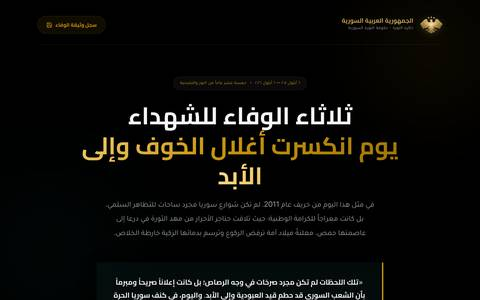 | أسود مسطّح · ذهبي · Cairo/Tajawal · عنوان مركزي بشريط تنقل وزر ذهبي · بلا ملمس | بيان، ميثاق، ملف توثيقي طويل | ثلاثاء الوفاء للشهداء · القبلة الواحدة · بين حقبتين · ثلاثاء الوفاء 2011 · جبلة القديمة ذاكرة الحجر (والنسخة بشهادة البحر) · جبلة صيف المدرج · ذاكرة 20 آب · فقه اللقاء · موسم تساقط الميليشيات · ميثاق التلاقي | بلا سبب مكتوب — مرجع لا قالب. **أكثر الأساليب تكراراً (11 موقعاً)** |
| 02 | صورة سينمائية بملء الشاشة وذهبي | 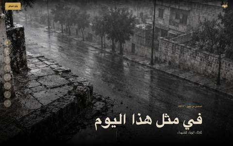 | صورة داكنة تملأ الشاشة · ذهبي · Cairo/Tajawal · عنوان على الجانب فوق الصورة · ملمس الصورة نفسها | رثاء، شهادة، قضية لها صور قوية | في مثل هذا اليوم · اختلفنا على الأسعار وانتصرنا بالكرامة · وثائقي سنوات التحصين الخمس · ثق بدولتك · ثق بدولتك النسخة الجديدة · اغتيال المصداقية · حروب الوعي · ذاكرة الأبواب · شجاعة الموقف · brave-stance و brave-stance-2 و trust-your-state-v2 _(قيد الانتظار)_ | المرجع مسجَّل بسببه في السجل أدناه؛ الباقي بلا سبب مكتوب |
| 03 | نص مشكول بكشاف ضوء | 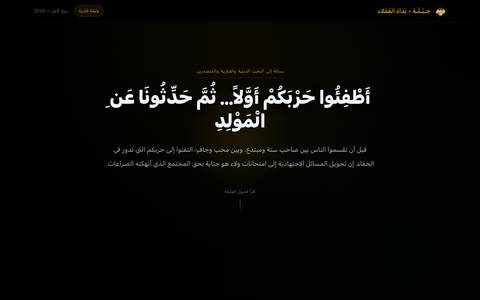 | أسود بتوهّج ذهبي خافت · أبيض · خط مشكول كبير · مركز · كشاف ضوء | نداء، رسالة، عنوان بليغ يحمل الصفحة وحده | أطفئوا حربكم أولاً · ثق بدولتك يا سوري · جبلة القديمة ذاكرة واقفة | بلا سبب مكتوب — مرجع لا قالب |
| 04 | سماوي استخباري | 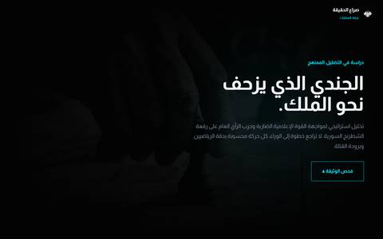 | أسود وأخضر ليلي · سماوي `#00E5FF` · خط هوية مخصص · نص جانبي على صورة معتمة · شاشة وتقنية | اختراق، حرب إلكترونية، تحقيق أمني | الجندي والملك · الضربة المعاكسة · كيف وقعت إيران في الشباك الأمريكية _(نسخته الأولى، ثم أُعيد بالأسلوب 24)_ | مسجَّل بسببه في السجل أدناه |
| 05 | أحمر إنذار | 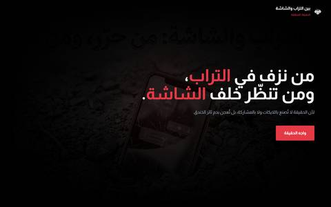 | أسود · أحمر `#E63946` · خط هوية مخصص · نص جانبي وزر أحمر · غبار خافت | تحذير، تضليل إعلامي، خطر عاجل | بين التراب والشاشة | بلا سبب مكتوب — مرجع لا قالب |
| 06 | رثاء دافئ بلا ذهب | 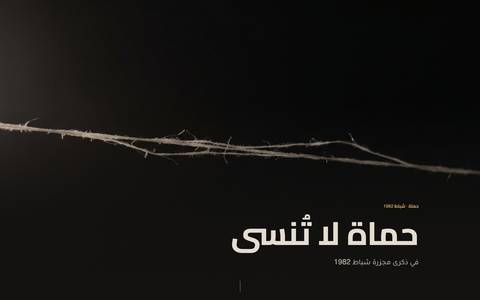 | داكن دافئ `#0f0e0d` · بُنّي غبار `#c39a6b` · Cairo/Tajawal · فراغ واسع وعنوان منخفض · تفصيل مادي واحد | مجزرة، ذكرى ثقيلة، رثاء صامت | حماة لا تُنسى · الخبز والملح | مسجَّل بسببه في السجل أدناه |
| 07 | احتفاء كهرماني بملمس قريب | 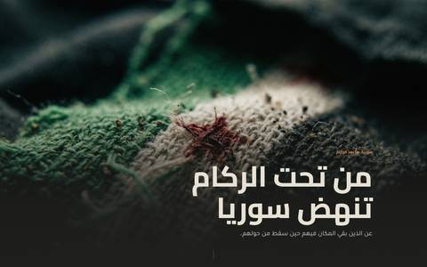 | رمادي دافئ `#1b1b19` · كهرماني `#d18250` · Cairo/Tajawal · فصول متناوبة · ملمس ماكرو | عودة، بناء، احتفاء هادئ | من تحت الركام تنهض سوريا · يا من تقولوا أبناء الخيم | مسجَّل بسببه في السجل أدناه |
| 08 | سيلويت رمادي بارد | 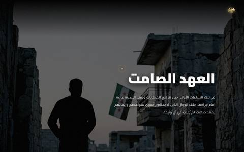 | رمادي بارد مغبر · أبيض بلا لون بطل · Tajawal/Cairo · سيلويت وعنوان جانبي · ضباب | صمت، فقد، عهد | العهد الصامت · the-silent-oath _(قيد الانتظار)_ | بلا سبب مكتوب — مرجع لا قالب |
| 09 | وجه قريب ولوحة زجاج | 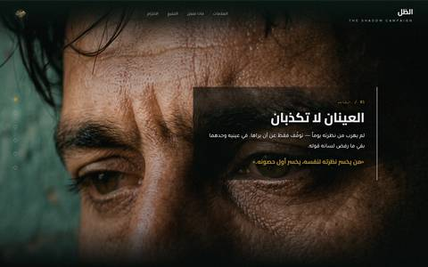 | صورة وجه دافئة قريبة · ذهبي · Cairo/Tajawal · لوحة نص زجاجية جانبية · زجاج | توعية، حملة اجتماعية، إدمان | الظل — توعية مخدرات | بلا سبب مكتوب — مرجع لا قالب |
| 10 | كحلي بأشعة ضوء | 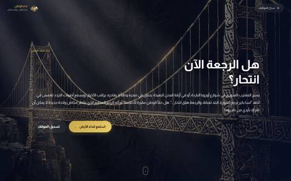 | كحلي رمادي · ذهبي · خط هوية مخصص · صورة معمار بأشعة ضوء وعنوان سؤال · ضباب ضوئي | عودة، سؤال مصيري، وطن ومغترب | نداء الوطن · نداء العودة | بلا سبب مكتوب — مرجع لا قالب |
| 11 | طباعي رمادي خافت | 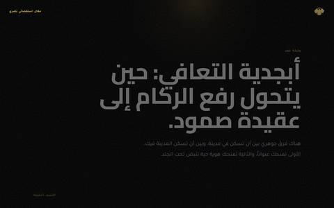 | أسود · رمادي بلا لون بطل · Cairo/Tajawal · عنوان ضخم محاذى بلا صورة · بلا ملمس | فكرة، مقالة، حملة بلا صور | حملة جبلة واللاذقية · jableh-campaign-test _(قيد الانتظار)_ | بلا سبب مكتوب — مرجع لا قالب |
| 12 | أرشيف منقسم بإطار صورة | 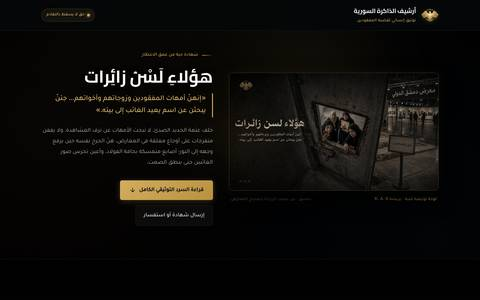 | أسود · ذهبي · Cairo/Tajawal · نص يمين وصورة مؤطّرة يسار · إطار أرشيفي | أرشيف، مفقودون، شهادات موثّقة | هؤلاء لسن زائرات · jableh-latakia-cleanup _(قيد الانتظار)_ | بلا سبب مكتوب — مرجع لا قالب |
| 13 | كحلي ونحاسي منقسم | 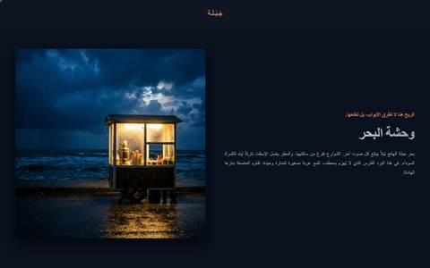 | كحلي `#0A111F` · نحاسي `#C87D53` · خط هوية مخصص · صورة يسار ونص يمين · ليل بحري | تراث، مدينة ساحلية، طعام وحياة يومية | سحلب وكعك جبلة | بلا سبب مكتوب — مرجع لا قالب |
| 14 | تجاري بمنتج | 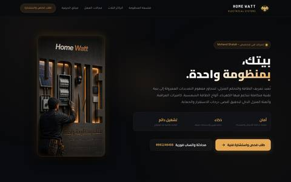 | أسود دافئ · ذهبي · Cairo/Tajawal · بطاقة منتج وصورة جهاز · أزرار تواصل | وجه تجاري، خدمة، شركة | هوم وات للكهرباء | بلا سبب مكتوب — مرجع لا قالب |
| 15 | سيبيا أرشيفي مؤطّر | 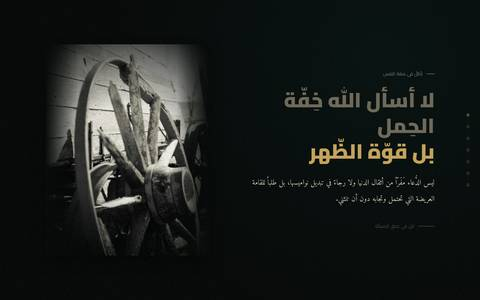 | داكن زيتوني `#050807` · ذهبي · Cairo/Tajawal · صورة سيبيا بتظليل حوافّ يسار ونص يمين · حبيبات أرشيفية | تاريخ، سيرة، نص فكري أو ديني | khaldoun-core-system | بلا سبب مكتوب — مرجع لا قالب |
| 16 | طباعة عملاقة على صورة | 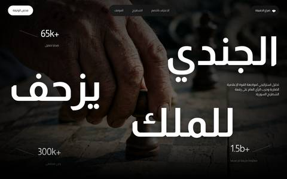 | صورة يد وتراب · أبيض بلا لون بطل · Cairo/Tajawal · عنوان يملأ الشاشة وعدّادات أرقام · ملمس الصورة | تحقيق رقمي، أرقام صادمة، حملة قوية | aljundi-walmalik-v2 _(قيد الانتظار)_ | بلا سبب مكتوب — مرجع لا قالب |
| 17 | صورة نهارية وثائقية دافئة | 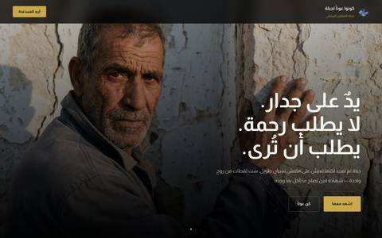 | صورة نهار دافئة لوجه أو مهنة · ذهبي · خط هوية مخصص · عنوان جانبي فوق الصورة · ضوء طبيعي | ناس المدينة، مبادرة مدنية، كرامة يومية | kono-awnan-ljabalah · جبلة من يصنعون المدينة _(قيد الانتظار)_ | بلا سبب مكتوب — مرجع لا قالب |
| 18 | تقرير كحلي بتوهّج | 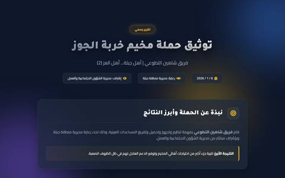 | كحلي `#0f172a` بتوهّج بنفسجي · كهرماني `#fbbf24` · خط افتراضي · عنوان مركزي وبطاقات بيانات · توهّج ناعم | تقرير فريق، حصيلة حملة، أرقام إنجاز | shaheen-team-report _(قيد الانتظار)_ | بلا سبب مكتوب — مرجع لا قالب |
| 19 | غروب مشبع سياحي | 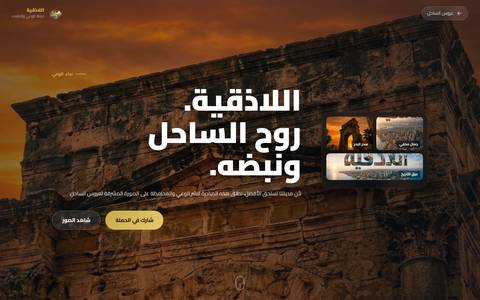 | صورة أطلال بسماء برتقالية مشبعة · ذهبي · Cairo · عنوان جانبي وبطاقات صور صغيرة · ضوء الغروب | سياحة، مدينة، تراث حيّ | اللاذقية _(قيد الانتظار)_ | بلا سبب مكتوب — مرجع لا قالب |
| 20 | شعاع ضوء في العتمة | 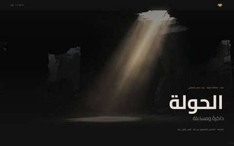 | داكن `#141414` · بُنّي ذهبي `#C89A5B` · Cairo/Tajawal · فراغ واسع وعنوان منخفض · شعاع ضوء حجمي | مجزرة، مساءلة، ذاكرة تنتظر العدالة | الحولة ذاكرة ومساءلة _(قيد الانتظار)_ | بلا سبب مكتوب — مرجع لا قالب |
| 21 | تراكب أزرق سياحي | 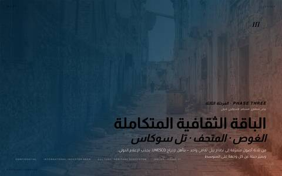 | صورة مدينة بتراكب أزرق مخضرّ باهت · ذهبي · Cairo/Amiri · عنوان سفلي بعنوان مرحلة لاتيني · تراكب لوني | دليل سياحي، باقة ثقافية، مراحل مشروع | جبله _(قيد الانتظار)_ | بلا سبب مكتوب — مرجع لا قالب |
| 22 | سجلّ ورقي فاتح | 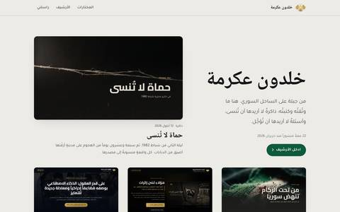 | ورق حجري `#EDEBE6` · أخضر الثورة `#0E5A3A` · Noto Naskh Arabic/Tajawal · سجلّ صفوف بالشهور مع بحث وفلترة · بلا ملمس | فهرس، أرشيف أعمال، بوابة مشاريع | بوابة خلدون عكرمة | مسجَّل بسببه في السجل أدناه. **أول أسلوب فاتح في البنك** |
| 23 | تأمل كوني بحقل نجوم | 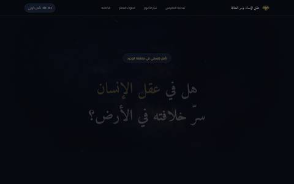 | أسود مزرقّ `#06090f` · ذهبي `#c9a557` · Amiri/Cairo · عنوان مركزي ثم حركات بصور كونية وعدّادات · حقل نجوم حيّ وسديم وحبيبات | تأمل فلسفي، سؤال وجودي، فكرة خارج المكان والزمان | هل في عقل الإنسان سرّ خلافته في الأرض؟ | مسجَّل بسببه في السجل أدناه |
| 24 | تحقيق تمريري غامر |  | فحمي بارد `#0E1012` · بطل واحد يُحسم في بطاقة الهوية · IBM Plex Sans Arabic وحده · عمود 720px تقطعه أقسام غامرة بعرض الشاشة · خلفيات صور بطبقات تتبدّل بالتمرير ودرج أدلة عائم | تحقيق من المصادر المفتوحة، كشف شبكة حسابات، تتبّع تضليل | كيف وقعت إيران في الشباك الأمريكية (نسخته الثانية) | حُفظ بطلب خلدون 2026-09-28 قبل أول موقع له: لا أسلوب في البنك يروي بطبقات تمريرية ويجمع أدلته في درج. المواصفة في `site-styles/24-osint-scroll/STYLE.md` |
| 25 | حجر دافئ بفصول تمريرية | 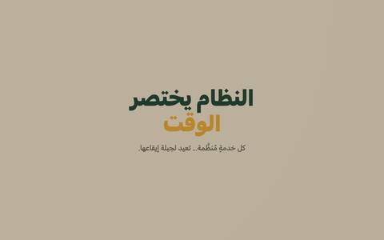 | حجر دافئ `#B9AD98` · أخضر غابي `#1F3A2B` مع ذهبي مغرة `#B8862B` · Cairo وحده · أربعة فصول تمريرية وساعة ثابتة وشاشة ختام · مفتاح ربط وظلّ يدوران مع التمرير (من `DESIGN.md`) | توعية مدنية هادئة بنبرة خدمية، وقصة قصيرة بعمود واحد | jableh-time | **أول أسلوب بأرضية حجرية دافئة وعنوان داكن**. أُضيف بقرار خلدون 2026-10-03 بعد أن اختلف عن 22 (الأقرب) في العائلة الخطية والشبكة والآلية. المصغّرة تُظهر شاشة الافتتاحية وحدها. |

| 26 | أطلس الحجر والضوء | 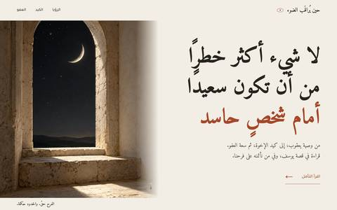 | ورق عاجي `#f2eee5` · حبر `#25241f` · بطل صدئي `#a6472a` · Amiri / Tajawal · افتتاحية تحريرية غير متناظرة وصور نافذة وقميص وجب وباب، وتكوين مداري تفاعلي · ظهور هادئ | تأمل أدبي في العلاقات والحدود والفرح | joy-under-glass (منشور) | أسلوب جديد بتفويض خلدون في 2026-10-06: قصة يوسف وإخوته تحمل معنى صيانة النعمة والعفو، والحجر والضوء يوحدان الصور؛ أول موقع له. |

**مصادر البنك:** `~/Movies/01_المشاريع_المكتملة/` و`02_المشاريع_قيد_الانتظار/` وجذر `~/Movies`. **خارجه:** `حارس_الفجر` بلا `index.html` · `khaldoun-a-akramah-app` تطبيق Vite يحتاج بناءً لا موقع · `jableh-poster-template` أداة بوستر (مالكها `html-tool-builder`) · `قالب_مشاريع_خلدون_وأنتي_جرافيتي` قالب بنص افتراضي · نسخ `~/Movies/Movies/` الإنجليزية مكررة لمواقع مسجّلة.

## السجلّ

| المشروع | التاريخ | الأسلوب | لون البطل | الخلفية | العائلة الخطّية | الشبكة | السبب |
|---|---|---|---|---|---|---|---|
| [`fi-mithl-hatha-alyawm`](https://kakramah.github.io/fi-mithl-hatha-alyawm/) — في مثل هذا اليوم · **منشور** | 2026-09-06 | 02 | `#C9A557` ذهبي | `#000000` + `#062538` | Cairo / Tajawal | تحريرية غير متناظرة | **رثاء**: ذكرى شهداء السادس من أيلول 2011. الداكن **اختيارٌ لا افتراض** — الصور نفسها منخفضة الإضاءة (فجرٌ مبلَّل)، واللوحة مشتقّة منها (`7.4.1`). العقاب `gold`. البطاقة كاملة في `DESIGN.md` الخاص به. |
| [`syria-rising-from-rubble`](https://kakramah.github.io/syria-rising-from-rubble/) · من تحت الركام تنهض سوريا · **منشور** | 2026-09-13 | 07 | `#d18250` كهرماني الغروب | `#1b1b19` + `#22211e` | Cairo / Tajawal | فصول متناوبة `1fr 1fr` (KHALDOUN-SITE-PATTERN) | **احتفاء هادئ** بالعودة والبناء. اللوحة مقيسة من الصور العشر (إسمنت وحجر وغروب)، والكهرماني من صورة العائدين. ليست سوداء مطلقة لأن الصور رمادية دافئة. |
| [`hama-1982`](https://kakramah.github.io/hama-1982/) · حماة لا تُنسى · **منشور** | 2026-09-13 | 06 | `#c39a6b` بُنّي الغبار | `#0f0e0d` + `#1a1816` | Cairo / Tajawal | فصول متناوبة `1fr 1fr` (KHALDOUN-SITE-PATTERN) | **رثاء وتوثيق** لمجزرة شباط 1982. ظلامٌ دافئ مقيس من الصور (إضاءة 13 إلى 57)، والبُنّي مشتق منها، واستُبعد أحمر السماء لضعف تباينه. ابتعادٌ مقصود عن أسود وذهبي «في مثل هذا اليوم». |
| [`Kakramah.github.io`](https://kakramah.github.io/) · بوابة خلدون عكرمة · **منشور** | 2026-09-23 | 22 | `#0E5A3A` أخضر علم الثورة | `#EDEBE6` + `#F6F5F1` | Noto Naskh Arabic / Tajawal | سجلّ صفوف بالشهور، ومختارات بعمودين ثم ثلاثة | **فهرس** (§0.3 في الدستور 4.1): إطار محايد لا يرث أسلوباً. 20 من 22 لقطة للأعمال داكنة بذهبي، فالإطار الفاتح يجعل كل عمل قطعة مستقلة، والأخضر يبتعد عن ذهبيها فلا يتنافسان. الأعداد محسوبة من `projects.json`. البطاقة كاملة في `DESIGN.md` الخاص به. |
| [`syria-dignity-sept2026`](https://kakramah.github.io/syria-dignity-sept2026/) · اختلفنا على الأسعار وانتصرنا بالكرامة · **منشور** | 2026-09-14 · قُيِّد 2026-09-23 | 02 | `#d4a843` ذهبي دافئ | `#0d0f12` + `#141719` | Cairo / Noto Naskh Arabic | صورة بملء الشاشة وعنوان فوقها، ثم فصول ومعرض | **مساءلة واحتفاء مدني** بيوم 14 سبتمبر 2026: غضب الأسعار وانتصار الكرامة. الذهبي مستخلص من ضوء المصباح في صورة العشاء العائلي، والأخضر من علم الثورة (بطاقة `DESIGN.md`). يرث بصمة 02 إلا خط المتن: النسخ للسرد الأدبي بدل Tajawal، ولا يظهر الفرق في المصغّرة. |
| [`syria-transition-shield`](https://kakramah.github.io/syria-transition-shield/) · وثائقي سنوات التحصين الخمس · **منشور** | 2026-09-14 · قُيِّد 2026-09-23 | 02 | `#c8964e` ذهب العقاب | `#0a0d12` + `#121820` | Cairo / Noto Naskh Arabic | صورة بملء الشاشة وعنوان مركزي، ثم فصول ومعرض من عشر بطاقات | **مساءلة سياسية** في الاصطفاف مع الدولة الجديدة خلال الفترة الانتقالية. اللوحة مستخرجة من خيمة الليل وحجارة الركام وذهب العقاب (بطاقة `DESIGN.md`). يرث بصمة 02 إلا خط المتن النسخ، والعنوان مركزي لا جانبي. |
| [`abnaa-al-khiyam`](https://kakramah.github.io/abnaa-al-khiyam/) · يا من تقولوا أبناء الخيم · **منشور** | 2026-09-16 · نُشر 2026-09-23 | 07 | `#d97736` كهرماني النار | `#141312` + `#1e1c19` | Cairo / Tajawal | فصول متناوبة `1fr 1fr` وفاصل صورة كاملة | **اعتزاز وردّ على لغة الازدراء**: أبناء المخيمات من سنوات النزوح إلى 8 كانون الأول 2024. اللوحة من شوادر الخيام وتراب المخيمات ولهب الدفء (بطاقة `DESIGN.md`). يطابق بصمة 07 في حقولها الخمسة: أرضية داكنة دافئة، وكهرماني، وCairo/Tajawal، وفصول متناوبة، وملمس حبيبي. |
| [`cosmic-mind`](https://kakramah.github.io/cosmic-mind/) · هل في عقل الإنسان سرّ خلافته في الأرض؟ · **منشور** | 2026-09-27 | 23 | `#c9a557` ذهبي | `#06090f` + `#0c1018` | Amiri / Cairo | سردية متوازنة حتى 960px في المشاهد المزدوجة | **تأمل فلسفي** في مفارقة ضآلة الجسد وعظمة العقل، والشعور المهيمن دهشة هادئة. المكان الكون لا مدينة، والزمان خارج الزمن، فالأرضية سواد مزرقّ بحقل نجوم لا لون مدينة. Amiri للعنوان وبيت الإمام علي، وCairo للمتن. العقاب `dark` بعرض 48px وشفافية 0.35 لأن النص شخصي لا سيادي. أسلوب جديد: لا أسلوب في البنك صُمم لهذا الموضوع (بطاقة `DESIGN.md`). |
| [`bread-and-salt`](https://kakramah.github.io/bread-and-salt/) · الخبز والملح · **منشور** | 2026-09-27 | 06 | `#c39a6b` بُنّي الغبار | `#0f0e0d` + `#1a1816` | Cairo / Tajawal | تناوب متزن بين النص المفسّر واللقطة المادية، وفراغ سلبي واسع | **قصة · تأمل في الوفاء والخيبة**، والشعور المهيمن مرارة هادئة لا غضب. رثاء صامت دافئ يبتعد عن بهرجة الذهب ليلامس خشونة الخبز وتراب المائدة. الخطوط صُحّحت إلى Cairo وTajawal في 2026-09-28 لتطابق موروث الأسلوب 06 (كانت Amiri). البطاقة كاملة في `DESIGN.md` الخاص به. |
| [`middle-east-power-trap`](https://kakramah.github.io/middle-east-power-trap/) · كيف وقعت إيران في الشباك الأمريكية · **منشور** | 2026-09-28 | 04 | `#00E5FF` سماوي بارد | `#080c10` + `#0d1620` | Cairo / Tajawal | مقال غامر مع نص جانبي وفصول متناوبة | **مساءلة سياسية وتحذير استراتيجي**: قراءة في منطق التمدد والانكشاف الإقليمي. الشعور المهيمن برودة تحليلية وثقل الحقيقة (الحبل يلتف حول العنق). الأسلوب 04 سماوي استخباري يناسب الاستقصاء والتحليل البارد. العقاب `dark` بعرض 56px وشفافية 0.25 لطبيعة الموضوع التحليلي لا السيادي الشخصي (بطاقة `DESIGN.md`). |
| [`middle-east-power-trap`](https://kakramah.github.io/middle-east-power-trap/) · كيف وقعت إيران في الشباك الأمريكية · **النسخة الثانية** | 2026-09-28 | 24 | `#C9A557` ذهبي الحبل | `#0E1012` + `#16191C` | IBM Plex Sans Arabic | قصة تمريرية: قسمان غامران بطبقات، وقسم جانبي ثابت، وخريطة نفوذ SVG، وعمود 720px | **مساءلة سياسية** أُعيد بناؤها بقرار خلدون بعد تجربة في `test-1`: الأسلوب 24 يعطي الصور الاستعارية الخمس حركة بطبقات القصّ والتقريب، وخريطة النفوذ ترسم صلات النص وحده. البطل ذهبي لأنه لون الحبل نفسه في الصور. أول موقع بالأسلوب 24 فصار مرجعه (بطاقة `DESIGN.md`). |
| [`jableh-time`](https://kakramah.github.io/jableh-time/) · النظام يختصر الوقت · **منشور** | 2026-10-03 | 25 | `#1F3A2B` أخضر | `#B9AD98` حجري | Cairo | أربعة فصول تمريرية وساعة ثابتة وشاشة ختام، وأعمدة حتى 600px | **توعية مدنية** بقيمة الوقت والخدمات المنظمة، بأسلوب واقعي ملموس (حجر كلسي وحديد زهر وأرصفة جبلة) لأن الغرض إحساس بأن الخدمات المنظمة بنية صلبة (بطاقة `DESIGN.md`). أول موقع بالأسلوب 25 فصار مرجعه. |

| [`joy-under-glass`](https://kakramah.github.io/joy-under-glass/) · حين يُراقَب الضوء · **منشور** | 2026-10-06 | 26 جديد | `#a6472a` صدئي | `#f2eee5` عاجي | Amiri / Tajawal | افتتاحية غير متناظرة، عمود أدبي وصورة، فاصلة نصية، حدود بعمودين، وخاتمة مضيئة | **تأمل أدبي**: الشعور انقباض ثم اتساع؛ الرؤيا والقميص والجب وباب العفو تحمل القصة، والورق الفاتح يترك الفرح حيّاً. جديد مقارنة بالأساليب 22 و20 و25. البطاقة في DESIGN.md الخاص به. نُشر بإذن خلدون في 2026-10-06، وتحقق الرابط والصور والتفاعل، وأُدرج في المنصة. |

## كيف يُقيَّد مشروع

صفٌّ واحد عند اجتياز البوابة، وقيمُه منقولةٌ من `DESIGN.md` الخاص بالمشروع لا مكتوبةٌ من جديد — فالبطاقة هي المالك، وهذا الجدول مرآةٌ للمقارنة.

**وعمود «السبب» هو عمود السجلّ الحقيقي.** الصفّ بلا سببٍ مكتوب لا يُقيَّد، لأن الغرض كلّه أن يُعرف بعد سنةٍ **لماذا** خرج هذا المشروع بهذه اللوحة.
